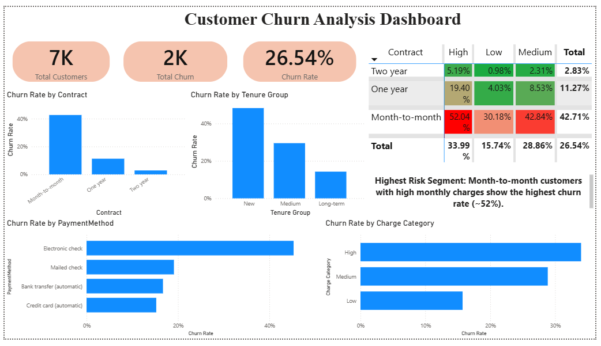
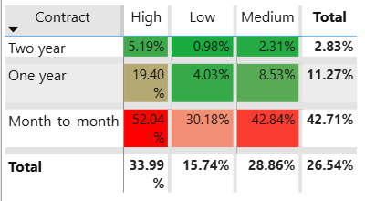

# Customer Churn Analysis

##  Project Overview
This project analyzes customer churn behavior using SQL and Power BI to identify key factors influencing customer attrition.

---

##  Objectives
- Calculate overall churn rate
- Identify high-risk customer segments
- Analyze impact of contract, tenure, charges, and payment methods
- Build an interactive dashboard

---

## Tools Used
- MySQL (Data Analysis)
- Power BI (Visualization)
- Excel (Data Cleaning)

---

##  Key Insights
- Month-to-month contracts have highest churn rate
- New customers are more likely to churn
- High monthly charges increase churn risk
- Electronic check users show higher churn
- Highest risk segment:
  - Month-to-month + high charges

---

##  Dashboard

---

##  Heatmap Analysis

---

##  Project Structure
- images/ → dashboard & heatmap screenshots
- sql/ → SQL queries
- report/ → project report

---

##  Business Impact
The analysis helps companies identify high-risk customers and improve retention strategies through data-driven decisions.
